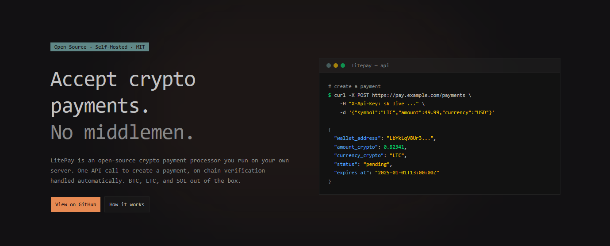

# LitePay

Self-hosted crypto payment processor for Bitcoin, Litecoin, and Solana. Accept payments from anywhere in the world without middlemen, fees, or third-party custody of funds.

---

## Quick Deploy (Docker)

```bash
cp .env-example .env
# Edit .env (set JWT_SECRET, RPC URLs, etc.)

docker compose up -d postgres vault
VAULT_ADDR=http://localhost:8200 sh scripts/vault-init.sh
# Follow instructions to set MASTER_SEED and update .env

docker compose up -d app
```

Access at `http://localhost:8080`

---

## Configuration

### Core Environment Variables

| Variable | Description |
|----------|-------------|
| `DATABASE_URL` | PostgreSQL connection string |
| `POSTGRES_PASSWORD` | Password for the postgres container |
| `JWT_SECRET` | Secret for signing tokens (min 32 chars) |
| `ALLOW_REGISTER` | Set to `false` to disable new merchant registration |
| `SECRET_PROVIDER` | Where to load master seed: `env`, `vault`, `bitwarden`, `aws`, `gcp` |
| `BTC_RPC_URL` | Bitcoin RPC endpoint |
| `LTC_RPC_URL` | Litecoin RPC endpoint |
| `SOL_RPC_URL` | Solana RPC endpoint |

### Secret Providers

LitePay supports multiple providers to securely store your 12/24-word master seed.

#### `env` (Simple)
```env
SECRET_PROVIDER=env
MASTER_SEED=word1 word2 ... word12
```

#### `vault` (Recommended)
```env
SECRET_PROVIDER=vault
VAULT_ADDR=http://vault:8200
VAULT_TOKEN=s.xxxxx
VAULT_MOUNT=secret
VAULT_PATH=litepay
VAULT_KEY=master_seed
```

#### `bitwarden`
```env
SECRET_PROVIDER=bitwarden
BITWARDEN_CLIENT_ID=...
BITWARDEN_CLIENT_SECRET=...
BITWARDEN_SECRET_ID=<uuid>
```

#### `aws` / `gcp`
Supports **AWS Secrets Manager** and **GCP Secret Manager**. Refer to `.env-example` for the specific variables required for each cloud provider.

---

## Merchant API

Authenticate using the API Key from your dashboard:
`Authorization: Bearer <API_KEY>`

### Create Payment
`POST /api/payment`

```json
{
  "symbol": "BTC",
  "amount": 49.99,
  "currency": "USD"
}
```

**Response (201):**
```json
{
  "id": "pay_550e8400...",
  "wallet_address": "bc1q...",
  "amount_crypto": 0.0015,
  "status": "PENDING"
}
```

### Get Payment Status
`GET /api/payment/:id`

**Statuses:** `PENDING`, `CONFIRMING`, `PAID`, `EXPIRED`, `REFUNDED`.

---

## Webhooks

LitePay sends POST requests with an `X-LitePay-Signature` (HMAC-SHA256) when payment status changes.

### Event Payload
```json
{
  "event": "payment.status_changed",
  "id": "pay_550e8400...",
  "status": "PAID",
  "amount_crypto": 0.0015,
  "transaction_hash": "0x..."
}
```

---

## Troubleshooting

- **Vault sealed?** Run `scripts/vault-unseal.sh`.
- **Payment missing?** Check RPC URLs and logs (`docker compose logs app`).
- **CORS issues?** Update `ALLOWED_ORIGINS` in `.env`.

---

## License

MIT - See LICENSE file
